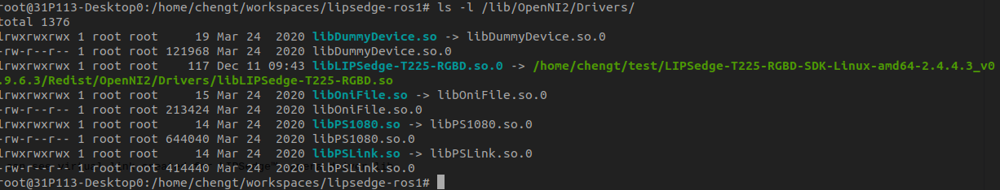
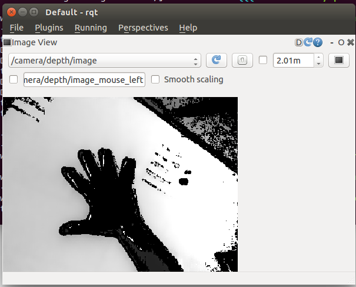
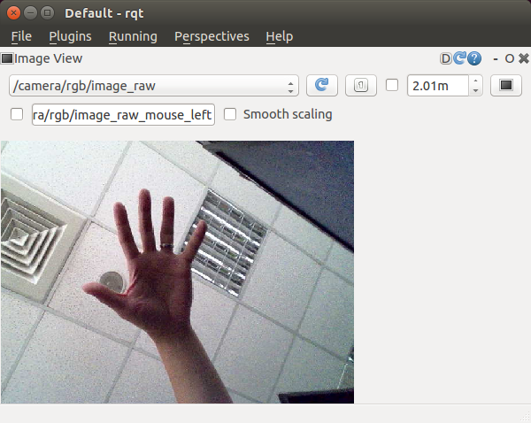

# ROS wrapper for OpenNI2 using LIPSedge™ camera T235

We have tested LIPSedge™ T235 camera in [ros1 noetic](https://hub.docker.com/r/osrf/ros/tags?name=noetic) docker container.

For other distro, we are not sure, if you have any request or need any support. Please mail to [LIPS](https://www.lips-hci.com/contact).

1. [Installation](#installation)
2. [Get wrapper source](#get-wrapper-source)
3. [Build and run driver](#build-and-run-driver)
4. [Launch rqt viewer](#launch-rqt-viewer)
5. [Troubleshooting](Troubleshooting.md)

## Installation

#### dependent packages

* Install openni2 packages
```
$ sudo apt-get install libopenni2-0 libopenni2-dev
```

* :point_right: Install runtime dependent ros packages
```
$ sudo apt-get install -y ros-noetic-image-geometry ros-noetic-camera-info-manager ros-noetic-rgbd-launch
```

#### LIPSedge™ camera T235 SDK

[Download](https://www.lips-hci.com/lipssdk) latest LIPSedge™ T235 SDK and install it.
```
for example,
$ cd ~/Downloads
$ chmod +x LIPSedge-T225-RGBD-SDK-Linux-amd64-2.4.4.3_v0.9.6.3.xz.run
$ ./LIPSedge-T225-RGBD-SDK-Linux-amd64-2.4.4.3_v0.9.6.3.xz.run
```
Follow steps on screen to finish installation.

*NOTE: If any error occurs during installation or you are not finished it, you can run it manually.*
```
$ cd LIPSedge-T225-RGBD-SDK-Linux-amd64-2.4.4.3_v0.9.6.3
$ sudo ./install.sh
```

## Get wrapper source

Clone this repository and build it in ROS environment

```
$ mkdir -p ~/workspace/src
$ cd ~/workspace/src
$ catkin_init_workspace
$ git clone https://github.com/lips-hci/LIPSedge-ros1
```

#### Setup OpenNI Dev Environment

Before running ros launch script, you have to deploy LIPSedge™ camera driver to system.

Go back to LIPSedge™ T235 SDK directory to run setup.
```
$ cd ~/Downloads
$ cd LIPSedge-T225-RGBD-SDK-Linux-amd64-2.4.4.3_v0.9.6.3
$ source OpenNIDevEnvironment
```

Run helper script in wrapper source to create virtual link to LIPSedge™ T235 camera driver.
```
$ cd ~/workspace/src
$ cd LIPSedge-ros1
$ ./scripts/install_ros_T235_ubuntu20_x64.sh

SDK path found: /home/chengt/test/LIPSedge-T225-RGBD-SDK-Linux-amd64-2.4.4.3_v0.9.6.3/Redist

Creating lib,calib,OpenNI2 links in /lib

Finished.
```

Make sure driver library has been installed to OpenNI2 Drivers repo in the system, you can see virtual link created for LIPSedge™ camera driver lib.
```
# ls -l /lib/OpenNI2/Drivers/
```


## Build and run driver

Run catkin make in workspace.
```
$ cd ~/workspace
$ catkin_make
$ source ./devel/setup.bash
$ roslaunch openni2_launch lipsedge_T235.launch
```

## Launch rqt viewer

Connect LIPSedge camera to your host PC and use rqt to view stream topics.
```
$ cd ~/LIPSToF_ws
$ rqt_image_view
```

* Select topic */camera/depth/image* in rqt


* Select topic */camera/rgb/image_raw* in rqt


#### OR you can try image_view if you got problem with running rqt.

* View Depth image
```
$ rosrun image_view image_view image:=/camera/depth/image
```
* View IR image
```
$ rosrun image_view image_view image:=/camera/ir/image
```
* View RGB image
```
$ rosrun image_view image_view image:=/camera/rgb/image_raw
```
