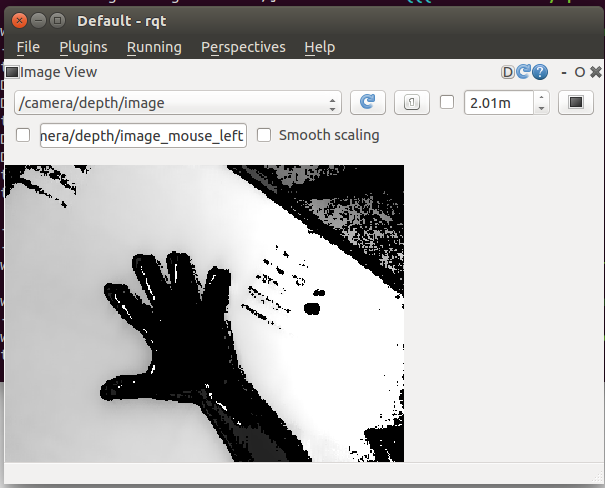
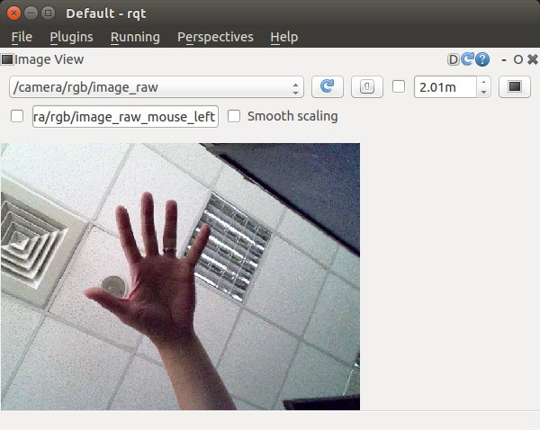

# ROS openni 2.0 wrapper for LIPSedge DL/M3 ToF cameras #

### 1. Install the pre-required ROS packages ###

* For Ubuntu 16.04 with ROS Kinetic
```
$ sudo apt-get install ros-kinetic-rgbd-launch
```
* For Ubuntu 14.04 with ROS Indigo
```
$ sudo apt-get install ros-indigo-rgbd-launch
```
### 2. Install openni2 packages for Ubuntu ###
Make sure you have openni2 package installed
```
$ sudo apt-get install libopenni2-0 libopenni2-dev
```
### 3. Download and install LIPS SDK with ROS support ###
Download SDK package from [LIPS SDK](https://www.lips-hci.com/downloads/category)
* Select your system: Ubuntu 16.04/14.04 (currently only 64-bit version is supported)
* Select the Platform: ROS (openni2)

Then install it to your system.

For example:
* If you get .deb package, type below command to install it to your Ubuntu OS.
```
$ sudo dpkg -i ROS-libmodule-lips2_1.5.0.7_amd64.deb
```
* If you get .tar.gz package, just run install.sh and it will install libraries to system automatically.
```
$ tar -xzf LIPS-Linux-x64-OpenNI2.2.tar.gz
$ cd LIPS-Linux-x64-OpenNI2.2
$ ./install.sh
```
NOTE: LIPS SDK package requires OpenCV, please refer this Wiki [page](https://github.com/lips-hci/openni_linux/wiki#install-opencv).
* If your OS is Ubuntu 14.04, you need OpenCV 2.4.11 (sources [2.4.11.zip](https://github.com/opencv/opencv/archive/2.4.11.zip)).
* If your OS is Ubuntu 16.04, you need OpenCV 3.1.0 (sources [3.1.0.zip](https://github.com/opencv/opencv/archive/3.1.0.zip)).

### 4. Download openni 2.0 wrapper source ###
This wrapper is modified to add support for video mode QQQVGA (80x60@30Hz).

You have to rebuild and install it on your ROS
```
$ mkdir -p ~/LIPSToF_ws/src
$ cd ~/LIPSToF_ws/src
$ catkin_init_workspace
$ git clone https://github.com/lips-hci/openni2_camera
```
### 5. Build and launch services ###
* For LIPSedge DL ToF camera
```
$ cd ~/LIPSToF_ws
$ ln -s src/openni2_camera/run_DL.sh .
$ ./run_DL.sh
```
* For LIPSedge M3 ToF camera
```
$ cd ~/LIPSToF_ws
$ ln -s src/openni2_camera/run_M3.sh .
$ ./run_M3.sh
```
### 6. Launch viewer to check depth/ir/rgb images ###
Make sure LIPSedge ToF camera is already connected to your host PC.
```
$ cd ~/LIPSToF_ws
$ ln -s src/openni2_camera/view.sh .
$ ./view.sh
```

* Select topic /camera/depth/image in rqt


* Select topic /camera/rgb/image_raw in rqt


#### NOTE: If you have problem with running rqt, try using image_view ####
* To view Depth image
```
$ rosrun image_view image_view image:=/camera/depth/image
```
* To view IR image
```
$ rosrun image_view image_view image:=/camera/ir/image
```
* To view RGB image
```
$ rosrun image_view image_view image:=/camera/rgb/raw_image
```
